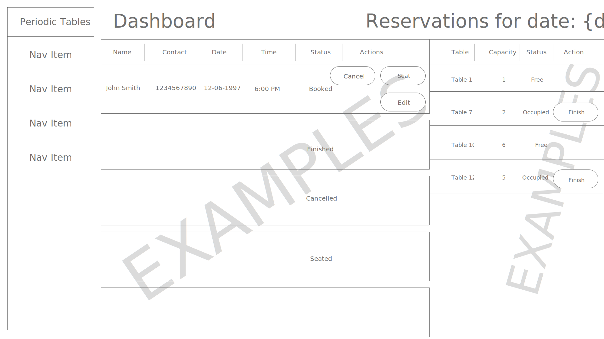

# Restaurant Reservation System

The software is for restaurant personnel to manage reservations and tables at their restaurants.  
This is a monorepo.

### 1. Working Prototype

You can access a working prototype of the React app here: https://restaurant-reservation-client.vercel.app/dashboard

### 2. User Stories

##### US-01 Create and list reservations (Importance - High) (Est. 6 hrs)

- As a restaurant manager
- I want to create a new reservation when a customer calls
- so that I know how many customers will arrive at the restaurant on a given day.

##### US-02 Create reservation on a future, working date (Importance - High) (Est. 2 hrs)

- As a restaurant manager
- I only want to allow reservations to be created on a day when we are open
- so that users do not accidentally create a reservation for days when we are closed.

##### US-03 Create reservation within eligible timeframe (Importance - Medium) (Est. 1 hr)

- As a restaurant manager
- I only want to allow reservations to be created during business hours, up to 60 minutes before closing
- so that users do not accidentally create a reservation for a time we cannot accommodate.

##### US-04 Seat reservation (Importance - High) (Est. 8 hrs)

- As a restaurant manager,
- When a customer with an existing reservation arrives at the restaurant
- I want to seat (assign) their reservation to a specific table
- so that I know which tables are occupied and free.

##### US-05 Finish an occupied table (Importance - High) (Est. 1 hr)

- As a restaurant manager
- I want to free up an occupied table when the guests leave
- so that I can seat new guests at that table.

##### US-06 Reservation Status (Importance - Medium) (Est. 3 hrs)

- As a restaurant manager
- I want a reservation to have a status of either booked, seated, or finished
- so that I can see which reservation parties are seated, and finished reservations are hidden from the dashboard.

##### US-07 Search for a reservation by phone number (Importance - Low) (Est. 5 hrs)

- As a restaurant manager
- I want to search for a reservation by phone number (partial or complete)
- so that I can quickly access a customer's reservation when they call about their reservation.

##### US-08 Change an existing reservation (Importance - Medium) (Est. 4 hrs)

- As a restaurant manager
- I want to be able to modify a reservation if a customer calls to change or cancel their reservation
- so that reservations are accurate and current.

### 3. Functionality

The app's functionality includes:

- Creating, editing, and cancelling a reservation
- Creating and managing tables within restaurant
- Managing the status of a seated reservation and their table
- Searching reservations quickly, by phone number
- View reservations and table statuses

### 4. Technology

- Front-End: HTML5, CSS3, JavaScript ES6, React, Bootstrap
- Back-End: Node.js, Express.js, Mocha, Chai, RESTful API Endpoints, Postgres
- Development Environment: Vercel, DBeaver

### 5. Wireframes

|             Dashboard (desktop) path: /dashboard              | New/Edit Reservation Form (desktop) path: /reservations/new |      Add Table Form (desktop) path: /tables/new       |
| :-----------------------------------------------------------: | :---------------------------------------------------------: | :---------------------------------------------------: |
|               |      |  |
| Seat Table (desktop) path: /reservations/:reservation_id/seat |                                                             |                                                       |
|              |                                                             |                                                       |

### 6. Front-end Structure - React Components Map

- **index.js** (stateless)
  - **App.js** (stateless)
    - **Layout.js** (stateless)
      - **Menu.js** (stateless) - Navigation sidebar
      - **Routes.js** (stateless) - routing file for URLs
        - **Dashboard.js** (stateless)
          - **Reservations.js** (stateful) - gets _reservations_ from Dashboard.js
            - **ReservationRows.js** (stateful) - gets _sortedReservations_ from Reservations.js
          - **Tables.js** (stateful) - gets _tables_, _reload_, _setReload_ from Dashboard.js
        - **NewReservation.js** (stateless)
          - **NewResForm.js** (stateful) - gets _formData_, _setFormData_, _setDateError_, _setFormError_, and today's date from NewReservation.js
        - **NewTable.js** (stateless)
          - **NewTableForm.js** (stateful) - gets _formData_, _setFormData_, _setFormError_ from NewTable.js
        - **SeatTable.js** (stateless)
          - **ReservationCard.js** (stateful) - gets _reservation_ from SeatTable.js - displays as Bootstrap card
          - **SeatTableForm.js** (stateful) - gets _tables_, _reservation_, _selection_, _setSelection_, and _setSeatError_ from SeatTable.js
        - **SearchBar.js** (stateful)
          - **Reservations.js** (stateful) - gets _reservations_ from SearchBar.js
            - **ReservationRows.js** (stateful) - gets _sortedReservations_ from Reservations.js
      - **ErrorAlert.js** (stateful) - Displays error alert when an error is present
      - **NotFound.js** (stateless) 404 Not Found

### 7. Back-end Structure - Business Objects

- Reservations (database table)

  - reservation_id (auto-generated)
  - first_name
  - last_name
  - mobile_number
  - reservation_date (formatted YYYY-MM-DD)
  - reservation_time (formatted HH-MM 24hr time)
  - people
  - status (booked, seated, finished)
  - created/updated_at timestamps

- Tables (database table)
  - table_id (auto-generated)
  - reservation_id (foreign ID from "reservations", controls table occupied status and seating)
  - table_name
  - capacity
  - created/updated_at timestamps

### 8. API Documentation

#### API Overview

```text
    /
    .
    ├── /reservations
    │   └── GET
    │       |
    |       POST
    |
    ├── /reservations/:reservation_id
    │   └── GET
    │       |
    |       PUT
    |
    ├── /reservations/:reservation_id/status
    │   └── PUT
    |
    ├── /tables
    │   └── GET
    │       |
    |       POST
    |
    ├── /tables/:table_id/seat
    │   └── PUT
    │       |
    |       DELETE
```

##### GET `/reservations`

```js
    // res.body.data
    // array containing:
    {
        "reservation_id": 1,
        "first_name": "John",
        "last_name": "Smith",
        "mobile_number": 1234567890,
        "reservation_date": "2020-01-20",
        "reservation_time": "14:30",
        "people": 5,
        "status": "booked",
        "created_at": "2020-12-10 03:30:32"
        "updated_at": "2020-12-10 03:30:32"
    }
```

##### POST `/reservations`

```js
    // req.body.data
    {
        "first_name": "John",
        "last_name": "Smith",
        "mobile_number": 1234567890,
        "reservation_date": "2020-01-20",
        "reservation_time": "14:30",
        "people": 5,
    }

    // res.body.data
    {
        "status": 201,
        "data": {
            "reservation_id": 1,
            "first_name": "John",
            "last_name": "Smith",
            "mobile_number": 1234567890,
            "reservation_date": "2020-01-20",
            "reservation_time": "14:30",
            "people": 5,
            "status": "booked",
            "created_at": "2020-12-10 03:30:32"
            "updated_at": "2020-12-10 03:30:32"
        }
    }
```

##### GET `/reservations/:reservation_id`

```js
    // res.body.data
    {
        "reservation_id": 1,
        "first_name": "John",
        "last_name": "Smith",
        "mobile_number": 1234567890,
        "reservation_date": "2020-01-20",
        "reservation_time": "14:30",
        "people": 5,
        "status": "booked",
        "created_at": "2020-12-10 03:30:32"
        "updated_at": "2020-12-10 03:30:32"
    }
```

##### PUT `/reservations/:reservation_id`

```js
    // req.body.data
    {
        "first_name": "John",
        "last_name": "Smith",
        "mobile_number": 1234567890,
        "reservation_date": "2020-01-20",
        "reservation_time": "14:30",
        "people": 5,
    }

    // res.body.data
    {
        "status": 201,
        "data": {
            "reservation_id": 1,
            "first_name": "John",
            "last_name": "Smith",
            "mobile_number": 1234567890,
            "reservation_date": "2020-01-20",
            "reservation_time": "14:30",
            "people": 5,
            "status": "booked",
            "created_at": "2020-12-10 03:30:32"
            "updated_at": "2020-12-10 03:30:32"
        }
    }
```

##### PUT `/reservations/:reservation_id/status`

```js
    // req.body.data
    {
        "status": "seated"
    }

    // res.body.data
    {
        "reservation_id": 1,
        "first_name": "John",
        "last_name": "Smith",
        "mobile_number": 1234567890,
        "reservation_date": "2020-01-20",
        "reservation_time": "14:30",
        "people": 5,
        "status": "seated",
        "created_at": "2020-12-10 03:30:32"
        "updated_at": "2020-12-10 03:30:32"
    }
```

##### GET `/tables`

```js
    // res.body.data
    // array containing:
    {
        "table_id": 2,
        "table_name": "Bar #3",
        "capacity": 1,
        "reservation_id": 1,
        "created_at": "2020-12-10 03:30:32"
        "updated_at": "2020-12-10 03:30:32"
    }
```

##### POST `/tables`

```js
    // req.body.data
    {
        "table_name": "Bar #3",
        "capacity": 1,
    }

    // res.body.data
    {
        "status": 201,
        "data": {
            "table_id": 2,
            "table_name": "Bar #3",
            "capacity": 1,
            "reservation_id": null,
            "created_at": "2020-12-10 03:30:32"
            "updated_at": "2020-12-10 03:30:32"
        }
    }
```

##### PUT `/tables/:table_id/seat`

```js
    // req.body.data
    {
        "reservation_id": 1
    }

    // res.body.data
    {
        "status": 200,
        "data": {
            "table_id": 2,
            "table_name": "Bar #3",
            "capacity": 1,
            "reservation_id": 1,
            "created_at": "2020-12-10 03:30:32"
            "updated_at": "2020-12-10 03:30:32"
        }
    }
```

##### DELETE `/tables/:table_id/seat`

```js
    // res.body.data
    {
        "status": 200
    }
```

### 9. Screenshots 

|               Dashboard - path: /dashboard               |          New Reservation Form - path: /reservations/new          |         Add Table Form - path: /tables/new         |
| :------------------------------------------------------: | :--------------------------------------------------------------: | :------------------------------------------------: |
|         |          |  |
|  Seat Table - path: /reservations/:reservation_id/seat   | Edit Reservation Form - path: /reservations/:reservation_id/edit |          Search by phone - path: /search           |
|  |          |      |

### Installation

1. Fork and clone this repository.
1. Run `cp ./back-end/.env.sample ./back-end/.env`.
1. Update the `./back-end/.env` file with the connection URL's to your ElephantSQL database instance.
1. Run `cp ./front-end/.env.sample ./front-end/.env`.
1. You should not need to make changes to the `./front-end/.env` file unless you want to connect to a backend at a location other than `http://localhost:5000`.
1. Run `npm install` to install project dependencies.
1. Run `npm run start:dev` to start your server in development mode.

If you have trouble getting the server to run, reach out for assistance.

##### Local React scripts

- To install the react project ===> npm install
- To run react (on port 3000) ===> npm start
- To run tests ===> npm run test

##### Local Node scripts

- To install the node project ===> npm install
- To migrate the database ===> npm run migrate -- 1
- To run Node server (on port 8000) ===> npm run dev
- To run tests ===> npm run test
